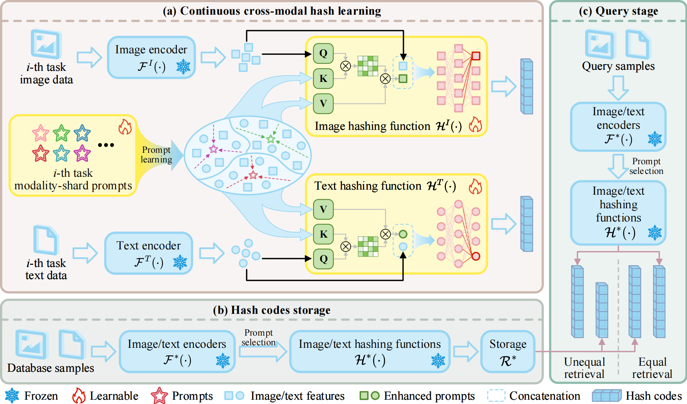

# PBEH
The source code for the paper "Prompt-driven Bit Extension Hashing".

## Abstract
Continual cross-modal hashing is critical for efficient retrieval across heterogeneous modalities in dynamic environments. Yet, existing approaches primarily focus on mitigating catastrophic forgetting, while overlooking two key challenges: 1) the hash collision arising from the excessive utilization of the Hamming space across tasks, and 2) the absence of consistency modeling for cross-modal dynamic associations. To address these challenges, we introduce Prompt-driven Bit Extension Hashing (PBEH), a novel framework that dynamically extends hash codes to prevent hash collisions and capture evolving modality-aligned semantics in continuously expanding multi-modal data. Specifically, PBEH first adaptively initializes a set of modality-shared prompts for each task, which are jointly optimized with the hashing functions to enhance model plasticity and retain task-specific knowledge, enabling continual cross-modal semantic alignment. In parallel, a dynamic Hamming space extension mechanism allocates dedicated capacity per task, alleviating bottlenecks and inter-task collisions. During retrieval, queries are encoded via the extended hash functions and matched to stored codes using a truncated strategy for compatibility. To ensure efficiency and semantic stability, only the prompts and hashing functions are updated while the pre-trained backbone remains frozen. Extensive experiments demonstrate that PBEH achieves superior and stable performance in continual cross-modal retrieval with substantially reduced computational overhead.

## The overall framework


The overall framework of our Prompt-driven Bit Extension Hashing (PBEH) for continual cross-modal retrieval. (a) During training, frozen pre-trained encoders perform **multi-modal embedding extraction**, followed by **modality-shared prompt learning** to obtain enhanced prompts. These prompts are concatenated with the embeddings and passed through hashing functions to generate binary codes. After each task, **dynamic Hamming space extension** is applied if necessary. (b) Database samples are encoded via the frozen encoders and hashing functions, with their hash codes stored. (c) At query time, query samples are similarly encoded and compared to stored codes for retrieval, supporting both equal and unequal code lengths.

## Datasets & Pre-trained CMH Models
1. Download datasets MSCOCO and NUSWIDE

```
MSCOCO
url: https://pan.baidu.com/s/1uJ5DgDIJIBRownazZXOWnA?pwd=2025
code: 2025

NUSWIDE
url: https://pan.baidu.com/s/17Rn92JwYELzV4YNQ2bndmg?pwd=2025
code: 2025

MSCOCO-Imbalance
url: https://pan.baidu.com/s/1gzUoMh3P-hH2iNysMxWSBA?pwd=2025
code: 2025

NUSWIDE-Imbalance
url: https://pan.baidu.com/s/1njmBa0j0EfeD_CzT0V4ZgA?pwd=2025
code: 2025
```

2. Change the value of `data_path` in file `main.py` to `/path/to/dataset`.

## Python Environment
``` bash
conda create -n PBEH python=3.8
conda activate PBEH
pip install -r requirements.txt
```

## Training
``` python
python main.py
```
